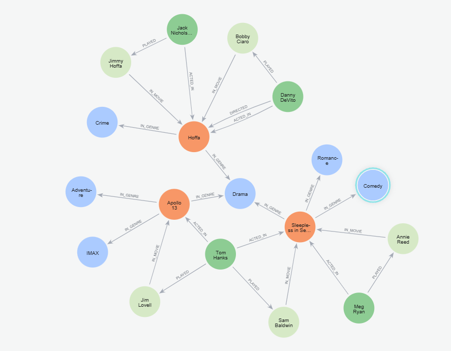

# neo4j-atna-knowledge-graph-labs
Hands-on projects and notes exploring **Neo4j** and **Knowledge Graph Data Modeling**.
---
## Project 1: Importing Data into Neo4j using the Data Importer

In this project, I explored how to use the **Neo4j Data Importer** to bring CSV data into a graph database and build connections between entities.  
The goal was to create a small graph that includes **Person** and **Movie** nodes linked by **ACTED_IN** relationships.

### Key Learnings
- Upload and map CSV files to node labels (`Person`, `Movie`)
- Define unique identifiers for nodes
- Map column data to properties
- Import and verify relationships (`ACTED_IN`) between nodes
- Validate the data using Cypher queries

By the end of this project, the Neo4j database contained:
- 🧑‍🤝‍🧑 `Person` nodes (from `persons.csv`)
- 🎬 `Movie` nodes (from `movies.csv`)
- 🔗 `ACTED_IN` relationships (from `acted_in.csv`)

  ---

## Project 2: Cypher Fundamentals  

This project focused on learning and applying **Cypher**, Neo4j’s declarative graph query language.  
I created, updated, and deleted nodes and relationships while practicing powerful graph queries such as filtering, aggregation, and pattern matching.

**Key Highlights**
- Queried and filtered nodes by properties (e.g., movies released after 2010)
- Used pattern matching to discover complex relationships  
- Practiced `MERGE`, `MATCH`, `WHERE`, and `RETURN` commands  
- Updated nodes dynamically with `SET` and removed properties with `REMOVE`  
- Learned to delete nodes and relationships safely

## Project 3: Graph Data Modeling Fundamentals  

In this project, I demonstrated my ability to design and refactor **graph data models** in Neo4j.  
Using the Movie domain dataset, I designed an initial schema, tested queries, and performed iterative refactoring to support new use cases and improve query performance.

**Objectives**
- Model movies, people, and users with appropriate labels and relationships  
- Refactor nodes into specialized labels (`Actor`, `Director`)  
- Normalize `Genre` and `Language` data  
- Add an intermediate `Role` node to represent characters in movies  
- Demonstrate Cypher queries for insights and validation  

**Core Entities**
| Label | Description |
|--------|-------------|
| `Movie` | A film with title, release date, and genres |
| `Person` | A real person involved in movie production |
| `Actor` | Specialized label for people who act in movies |
| `Director` | Specialized label for people who direct movies |
| `User` | A user who rates movies |
| `Genre` | Movie category (e.g., Drama, Comedy) |
| `Role` | Represents a character played by an actor |

**Key Relationships**
| Relationship | Description |
|---------------|-------------|
| `(:Actor)-[:ACTED_IN]->(:Movie)` | Links an actor to the movie they acted in |
| `(:Director)-[:DIRECTED]->(:Movie)` | Connects a director to their movie |
| `(:User)-[:RATED]->(:Movie)` | Represents user ratings for movies |
| `(:Movie)-[:IN_GENRE]->(:Genre)` | Categorizes a movie by genre |
| `(:Actor)-[:PLAYED]->(:Role)-[:IN_MOVIE]->(:Movie)` | Adds intermediate character representation |

---

## Project 4: Intermediate Cypher Queries

This project advanced my Neo4j Cypher expertise by introducing **intermediate query concepts**, including filtering, result control, traversal, pipelining, subqueries, and parameterization.  
Each concept was implemented as an individual `.cypher` script and visualized in Neo4j Browser.

### Focus Areas
- **Filtering Queries** – Used `WHERE` clauses with logical operators to refine datasets.  
- **Controlling Results** – Applied `ORDER BY`, `LIMIT`, and projections to manage returned data.  
- **Graph Traversal** – Explored variable-length patterns to connect actors, roles, and movies.  
- **Pipelining Queries** – Combined aggregation and filtering to compute insights efficiently.  
- **Subqueries** – Used `CALL {}` blocks to modularize query logic and summarize movie roles.  
- **Using Parameters** – Demonstrated reusable parameterized Cypher for dynamic inputs.

### Outcomes
- Produced modular, reusable Cypher scripts under `/cypher_scripts`.  
- Verified and visualized results through the `/visual_results` screenshots.  
- Showcased performance-focused Cypher design principles for scalable querying.

---

## 🖼️ Visual Results  

Below are the complete Neo4j visual results that capture the **end-to-end graph modeling workflow** — from data import to schema refinement and query validation.  

These screenshots illustrate how each project evolved through key stages:
1. Importing and mapping raw data into Neo4j  
2. Creating and validating relationships between nodes  
3. Running Cypher queries to extract insights  
4. Refactoring and visualizing the final graph model  

Together, they demonstrate the practical application of **Neo4j Fundamentals**, **Cypher Fundamentals**, and **Graph Data Modeling Fundamentals** — across both the **Movie Graph** and the **Global Earthquake–Tsunami Risk Challenge** domains.

| Screenshot | Description |
|-------------|--------------|
|  | **Movie data imported** successfully using the Neo4j Data Importer. |
|  | Import summary displaying the creation of nodes and relationships from CSV files. |
|  | Configuring the **ACTED_IN** relationship between `Person` and `Movie`. |
|  | Verified graph connections between actors and movies. |
|  | Added a `User` node and established **RATED** relationships for interaction tracking. |
|  | Displaying Neo4j **index and constraint** settings for optimized query performance. |
|  | Importing the **Global Earthquake–Tsunami Risk dataset** using Neo4j Data Importer. |
|  | Created `Earthquake`, `Location`, and `TsunamiRisk` nodes with their properties. |
|  | Visualizing the **OCCURRED_IN** relationships connecting `Earthquake` to `Location`. |
|  | Showing **HAS_TSUNAMI_RISK** connections from `Earthquake` to `TsunamiRisk`. |
|  | Running Cypher queries to retrieve movie–actor relationships. |
|  | Query results showing the `Earthquake` and `Location` link visualization. |
|  | Viewing directed relationships between earthquakes and tsunami risks. |
|  | Cypher result graph verifying the connections between users, ratings, and movies. |
|  | Initial model showing `Person`, `Movie`, and `Genre` nodes before refactoring. |
|  | Model after refactoring with `Actor`, `Director`, and `Genre` nodes. |
|  | Cypher query results showing actors, roles, and their movies. |
|  | Final schema visualization after refactoring and normalization. |
|  | Demonstrates filtering movies by genre, release year, or actor attributes. |
|  | Shows ordering, limiting, and projecting query results using `ORDER BY`, `LIMIT`, and `RETURN`. |
|  | Displays traversal between `Actor`, `Role`, and `Movie` nodes with variable-length paths. |
|  | Illustrates query pipelining for aggregated insights such as movie counts per actor. |
|  | Demonstrates the use of subqueries to group movies and roles for each actor. |
|  | Executes a parameterized Cypher query to dynamically retrieve data for a given actor. |

---

### ✅ Summary  

This project demonstrates:
- Translating use cases into a functional graph model  
- Iterative model refactoring using Cypher  
- Creating specialized node labels and relationships  
- Designing flexible, query-efficient graph structures  
- Applying best practices for Neo4j data modeling   
- Building two connected graph models:
  - 🎬 **Movie–Person–User Graph**  
  - 🌎 **Global Earthquake–Tsunami Risk Graph**  

---
## 📚 Projects Overview  

| # | Project Title | Description |
|---|---------------|--------------|
| 1 | [Importing Nodes from CSV using Data Importer](./01_data_importer_basics/README.md) | Importing and mapping data from CSV to Neo4j nodes and relationships. |
|   | [Challenge: Global Earthquake–Tsunami Risk Graph](./01_data_importer_basics/README.md#-challenge-global-earthquake–tsunami-risk-graph) | Modeled `Earthquake`, `Location`, and `TsunamiRisk` nodes and relationships. |
| 2 | [Project 2: Cypher Fundamentals](./Project_02_Cypher_Fundamentals/README.md) | Query, filter, create, update, and delete data using Cypher. |
| 3 | [Project 3: Graph Data Modeling Fundamentals](./Project_03_Graph_Data_Modeling/README.md) | Designed and refactored a graph data model for the Movie domain using Neo4j. |
| 4 | [Project 4: Intermediate Cypher Queries](./Project_04_Intermediate_Cypher_Queries/README.md) | Explored filtering, controlling results, graph traversal, pipelining, subqueries, and parameterized queries in Neo4j Cypher. |

---
 
### 💬 Author
**Dr. Rose Yemson**  
PhD | Knowledge Graph & Data Modeling Enthusiast  
[LinkedIn](https://linkedin.com) • [GitHub](https://github.com/atnazhin)
